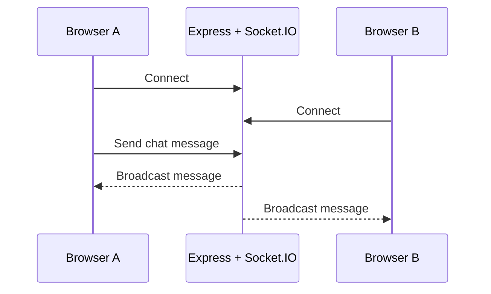

# Socket.IO Chat App

<div align="center">


A small real-time chat experiment built while learning Socket.IO.

</div>



## Repository layout

- `server.js` serves the static client and hosts the Socket.IO server.
- `public/` contains the original HTML, CSS, and browser-side JavaScript client.
- `messenger-clone/` is a separate Next.js UI experiment and has its own package manifest.

## Run the Socket.IO demo

```bash
npm install
node server.js
```

Open the local address printed by the server in two browser tabs to test real-time messaging.

## Run the Next.js UI experiment

```bash
cd messenger-clone
npm install
npm run dev
```

## Status

This repository contains learning experiments rather than a production chat service. Authentication, durable message storage, moderation, and deployment hardening are outside its current scope.
